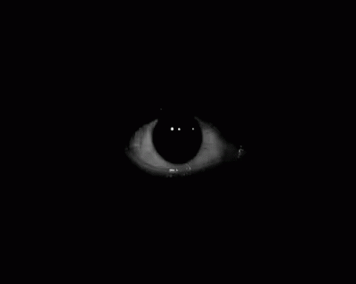
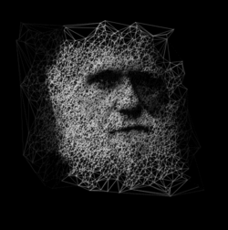

## MMM-EyeCandy

Animated images that are superficially attractive and entertaining but intellectually undemanding.

Add some EyeCandy to your mirror. Some are funny. Some are cool. All are entertaining.

You can even choose your own local images or internet images.

## Examples

, ,

## Installation

* `git clone https://github.com/mykle1/MMM-EyeCandy.git` into the `~/MagicMirror/modules` directory.
* No API needed!
* Annotated .css file included for exact sizing.

## Config.js entry and options

    {
        module: "MMM-EyeCandy",
		position: "top_center",
		config: {
			maxWidth: "75%",       // Sizes the images. Retains aspect ratio.
			style: '1',            // 1 - 52 or use ownImagePath to override style
			ownImagePath: '',      // ex: 'modules/MMM-EyeCandy/pix/YOUR_PICTURE_NAME.jpg', or internet url to image
		}
	},
	
## Choose your config.js "style:" from this list.
## Just the number!

* Remember to use the css file to size these just the way you want them!

*  1 - Crazy human eye
*  2 - Cartoon eyes
*  3 - Cat-like eyes (red)
*  4 - Cat-like eyes (green)
*  5 - Wolf-like eyes (golden)
*  6 - Cartoon eyes (yellow)
*  7 - Wolf-like eyes (blue)
*  8 - Cartoon eyes (blue)
*  9 - Single cartoon eye (blue)
* 10 - Rotating 3D eye
* 11 - Blinking 3D marble sphere eye
* 12 - Eye rolling
* 13 - Human eye looking through hole
* 14 - Your name in lights (go to http://www.picgifs.com/name-graphics. Choose your name. Use ownImagePath.

## Faces and heads

* 15 - Female face warp
* 16 - Male face warp
* 17 - Male face to mask
* 18 - Ancient male face (Best in class)
* 52 - Bad hair day (female)
* 38 - 3D skull
* 46 - 3D skull of light

## Some of these are stunning

* 19 - 3D object
* 20 - 3D object (alive?)
* 21 - Wreath of arms and hands
* 22 - 3D object (tire?)
* 23 - Circle of motion
* 24 - Pulsating globual
* 25 - Colored (paper object?)
* 26 - Hairy thing
* 27 - Metallic undulating thing
* 28 - Inside out
* 29 - Not a pretzel
* 30 - Endless coral snake?
* 31 - Tilt O' Whirl tree
* 32 - Kaleidoscope?
* 33 - 3D Cube
* 34 - Endless butterfly?
* 35 - Not quite a zebra
* 36 - Hollow ball of colored string
* 37 - Star eating plasma
* 39 - A whatchamacallit?
* 40 - A different whatchamacallit?
* 41 - 7/8 of a cow donut
* 42 - Yin and Yang like you've never seen before
* 43 - Endless coral snake pretzel?
* 44 - Clouds passing the moon
* 45 - Hollow 3D sphere of dots
* 47 - Liquid candy
* 48 - Liquid candy 2
* 49 - Johnny Dep? WTF? ( Use ownImagePath for the same effect )

## Smiley

* 50 - The cutest fucking 3D smiley face. (Are you mad I said "cutest" or "fucking?")
* 51 - When smiley faces are in love it's pathetic.

## Remember!

* You can always use local files that you have or url's to internet photos
* I know, I said this already. Use the css file to size the animations

